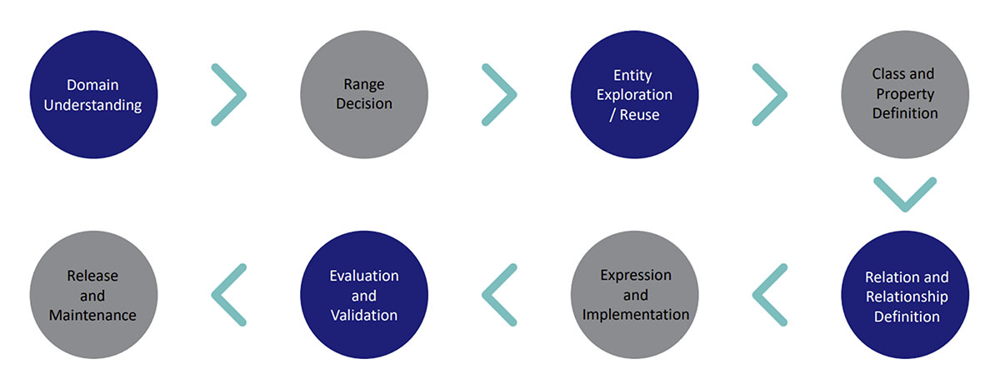

WattSchema’s structure reflects practical experience deploying semantic models in operational environments. The following principles guide its design and evolution.

## 4.1 Explicit Relationships Over Implicit Conventions

Many legacy models rely on naming conventions, drawings, or vendor-specific hierarchies to imply system structure. WattSchema instead models relationships directly: electrical connectivity, thermal supply paths, containment, measurement, and control associations are all first-class elements.

This enables automated validation, topology traversal, and reasoning about dependencies, redundancy, and failure domains.

## 4.2 Validation as a First-Class Capability

WattSchema is designed to work alongside constraint frameworks such as Shapes Constraint Language (SHACL), allowing stakeholders to formally define what constitutes a complete or valid model for a given use case.

This supports:

- Design and commissioning validation
- Model exchange between engineering firms and operators
- Continuous conformance checking as systems evolve

## 4.3 Interoperable by Design

WattSchema is not intended to exist in isolation. Rather than redefining foundational concepts, WattSchema builds on existing standards, most notably ASHRAE 223, extending them where necessary to capture data center-specific architectures.

The same conceptual entities such as equipment, connections, measurements, and roles are reused across representations, reducing the need for fragile one-off mappings and making it easier for tools in different domains to share a common understanding of infrastructure.

