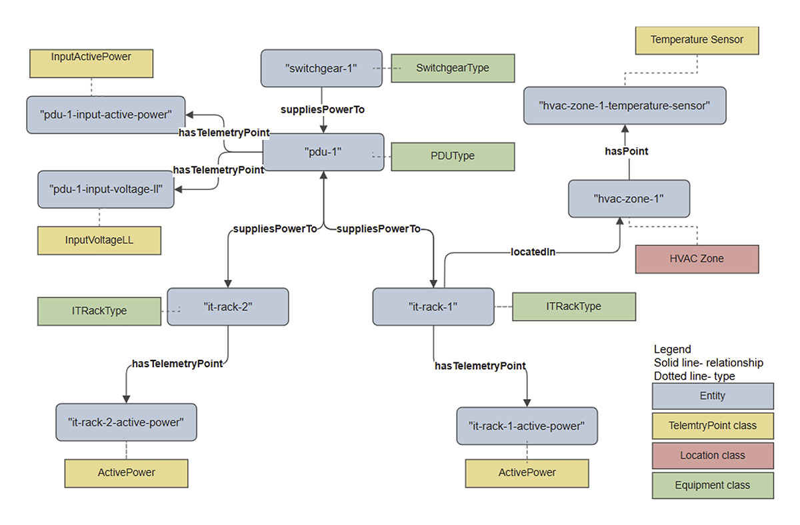

WattSchema is intentionally positioned as a complement to, not a replacement for, existing semantic efforts:

- ASHRAE 223 provides the foundational semantics for physical systems and observed phenomena.
- Brick Schema offers a mature vocabulary for building equipment and points, widely adopted in building automation contexts.
- RealEstateCore addresses portfolio- and asset-level concerns above individual facilities.

WattSchema focuses on the **power and cooling semantics unique to data centers**, while remaining interoperable in linked-data environments.

